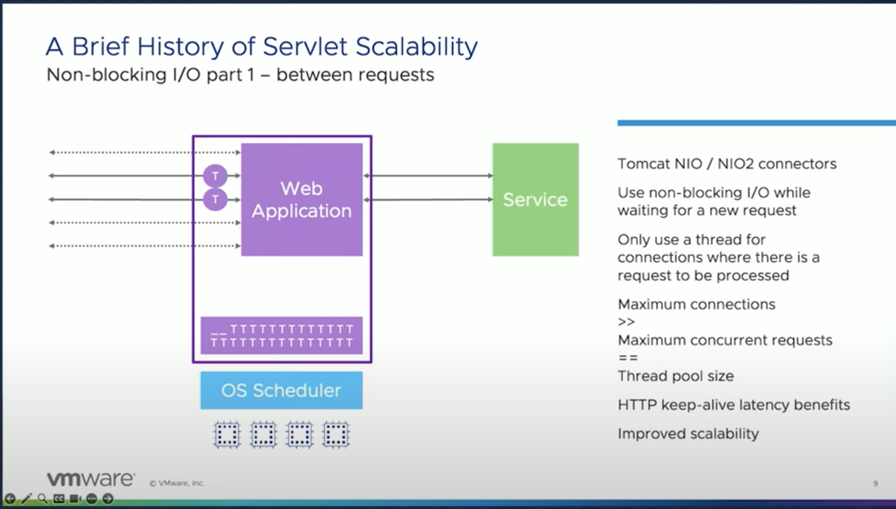
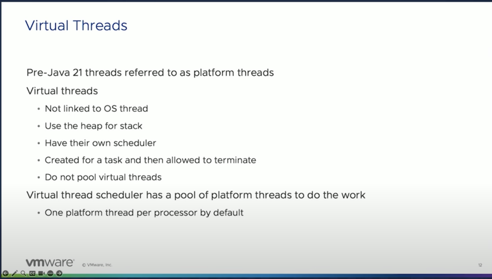

# SpringBoot With Virtual Threads

- [How to enable Virtual Threads for HttpRequest Processing](#how-to-enable-virtual-threads-for-httprequest-processing)
- [ab benchmark testing](#ab---testing)
  - [With Platform Threads](#with-platform-threads)
    - [With Platform Threads - Default 200 Threads](#with-platform-threads---default-200-threads)
  - [With Virtual Threads](#with-virtual-threads)
    - [Observation](#observation)
- [Preparing Web Applications for Loom SpringBoot ](#preparing-web-applications-for-loom)
  - [A typical Web Application](#a-typical-web-application)
    - [Brief History of HTTP scalability](#brief-history-of-http-scalability)
  - [Virtual Threads](#virtual-threads)
    - [Blocking Operations in Virtual Threads ](#virtual-threads-blocking-operations)
    - [Virtual Threads Coding Constraints](#virtual-threads-coding-constraints)
  - [Virtual Threads in a Web App](#virtual-threads-in-a-web-app)
  - [Throughput](#throughput)
    - [Throughput Comparison](#throughput-comparison)

## How to enable Virtual Threads for HttpRequest Processing?

- Add this property to enable virtual threads.

```yml
spring:
  threads:
    virtual:
      enabled: true
```

## ab - Testing

### With Platform Threads

```yml
server:
  tomcat:
    threads:
      max: 10
```

- The bench marking command to execute and perform **ab** testing.

```text
ab -n 60 -c 20  http://localhost:8080/blocking/3   
```

```text
Time taken for tests:   21.213 seconds
```

- Explanation for total time taken:
    - Even though we set the concurrency as 20 in the ab test, the total number of requests handled by tomcat is 10.
    - So 60/10 => 6
    - Each request takes 3 seconds.
        - So in this case, **6 * 3 seconds => 18 seconds**.
- The ab test gives you the result close approximate, so the result is 21 seconds.

### With Platform Threads - Default 200 Threads

```text
ab -n 600 -c 200  http://localhost:8080/blocking/3   
```
- The total time taken is below:

```
~/Dilip/code-with-dilip/explore-springboot-3 (main*) » ab -n 600 -c 200  http://localhost:8080/blocking/3                                                            54 ↵ dilipbandlasundarraj@dilips-mbp
This is ApacheBench, Version 2.3 <$Revision: 1901567 $>
Copyright 1996 Adam Twiss, Zeus Technology Ltd, http://www.zeustech.net/
Licensed to The Apache Software Foundation, http://www.apache.org/

Benchmarking localhost (be patient)
Completed 100 requests
Completed 200 requests
Completed 300 requests
Completed 400 requests
Completed 500 requests
apr_pollset_poll: The timeout specified has expired (70007)
Total of 542 requests completed
```

### With Virtual Threads
- The command to run performance testing.

```yml
server:
  tomcat:
    threads:
      max: 10
spring:
  threads:
    virtual:
      enabled: true
```
- The bench marking command to execute and perform **ab** testing.

```text
ab -n 60 -c 20  http://localhost:8080/blocking/3   
```
- Explanation for total time taken:
    - Even though we set the concurrency as 20 in the ab test, the total number of requests handled by tomcat is 10.
    - In this case, we use virtual threads which basically unmounts when there is a blocking operation.
      - So in this case all the 20 requests are executed concurrently 
      - The timing split is going to be like this => 60/20 => 3
    - Each request takes 3 seconds.
        - So in this case, **3 * 3 seconds => 9 seconds**.
- The ab test gives you the result close approximate, so the result is **12.210** seconds.
- 
```text
Time taken for tests:   12.210 seconds
```

#### Observation
- The performance is better by just switching it to virtual threads because virtual threads work differently under the hood.
- Because there is no one-one mapping between virtual thread and the platform(carrier) thread.
  - The platform thread that's running the virtual thread is called a **carrier thread**. 
  - Anytime a blocking operation is performed then it gets unmounted from the carrier thread.
- Extensive more Concurrent user testing is still needed.
  - 100 request with 50 concurrent user testing is needed.
  - 600 request with 100 concurrent user testing is needed.
  - 600 request with 200 concurrent user testing is needed.

## Preparing Web Applications for Loom
- This is a talk from this [youtube video](https://www.youtube.com/watch?v=rly6U0yT5Kg&list=PLnXn1AViWyL71Svn1y4zyVxOhHFrm70mS&index=7&t=1331s&ab_channel=SpringI%2FO)

### A typical Web Application
- We have the tomcat here with its own thread pool.
- The OS scheduler is responsible for scheduling these threads in the available cores.
  - The threadpool of the platform threads uses a linked blocking queue.


#### Brief History of HTTP scalability
- HTTP 1.0
  - Connect, make request, close
    - The connect step needs to make the network round trip to establish the connection.
  - One thread per connection.
  - Maximum Connections = Maximum Concurrency == Thread pool size.
  - **Note : Creating Connections are expensive**.
- HTTP 1.1/Keep Alive
  - Keep the connection open, this saves the round trip to establish the connection.
  - Better latency
  - Worse scalability
    - The keep alive handled less concurrent requests
- Non-Blocking IO
  - 
- Servlet Asynchronous IO
  - 

### Virtual Threads
- They are only connected to the platform thread.
- They do have a stack, rather than having their own memory area they just live in the heap.
- They have their own scheduler
  - Which of these 100,1000,100000 or 1 million threads are going to be mapped in to the small pool of platform(carrier) threads.
  - This is completely controlled by the JVM.
  - It uses a work-stealing queue which is a copy of the forkjoin pool.
- Do not pool virtual threads
- Virtual Thread Scheduler has a small pool of platform threads that does the work.
  - One platform thread per processor by default.


#### Virtual Threads Blocking operations
- Platform Threads
  - Any blocking operations the platform threads block and wait for it to complete.
- Virtual Threads
  - Non blocking operation started
  - Virtual Threads suspend and the platform thread released
  - Operation Completes
  - Virtual Threads resume and eligible to be scheduled
  - Execution continues
- Virtual Threads are effectively non-blocking for blocking operations
  - We get better scalability for free.

#### Virtual Threads Coding Constraints


#### Virtual Threads in a Web App


- Running a **Tomcat** server without the virtual threads will have 200 platform threads.
  - In this case the 200 threads will be scheduled by the OS scheduler for the CPU time.
- Running a **Tomcat** server with virtual threads will have the platform threads equal to the number of the cores of the machine.
  - In this case, the virtual thread scheduler will schedule the virtual threads and then the platform thread will be mapped.
  - This then gets submitted to the OS run queue and then this gets executed by the OS scheduler.

### Throughput

- Compare the virtual threads and the tomcat threads in the same scenario.
- minimize the impact of the other factors
  - Try to keep the **tomcat platform threads** as similar to the no-of-cores of the machine instead of the 200 threads.


#### Throughput Comparison
- Bigger the response, lesser the difference.
- 

